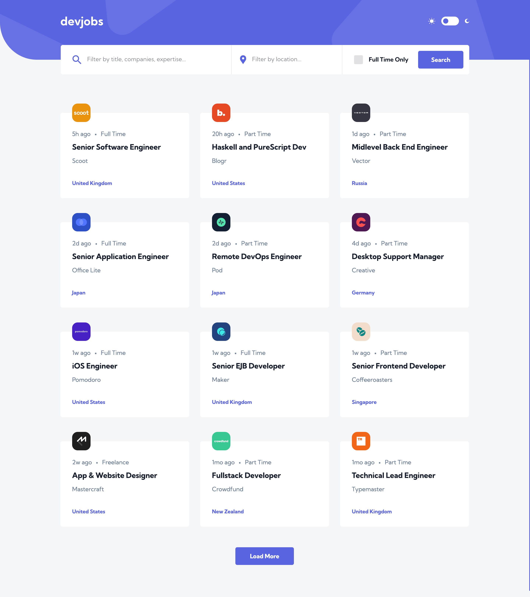
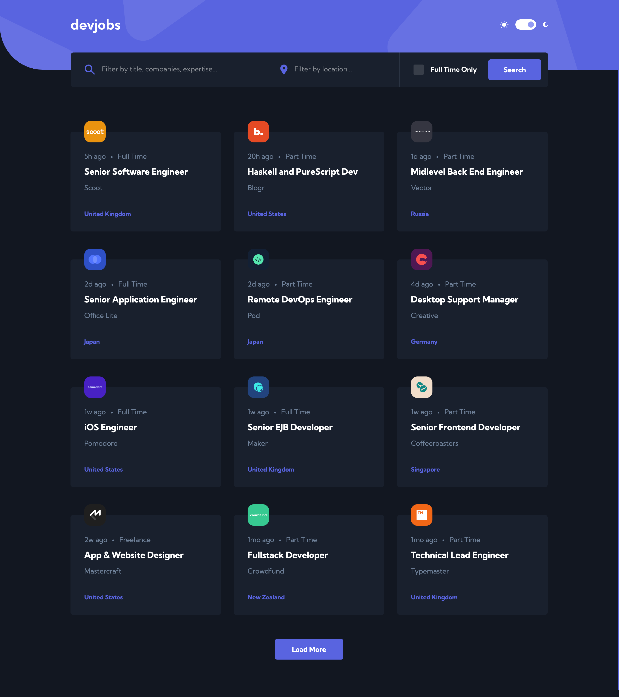
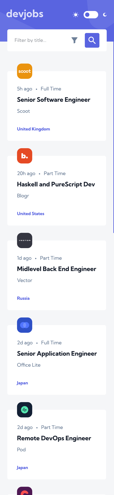
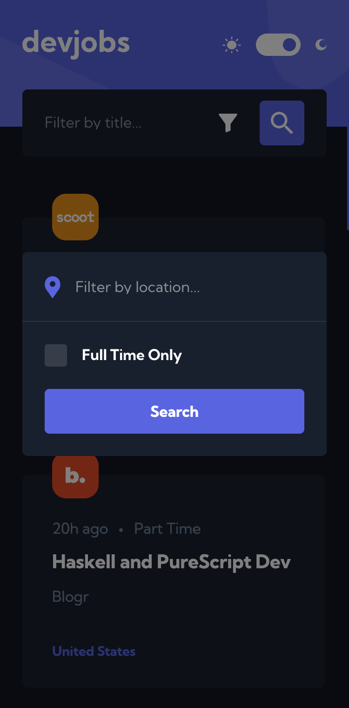
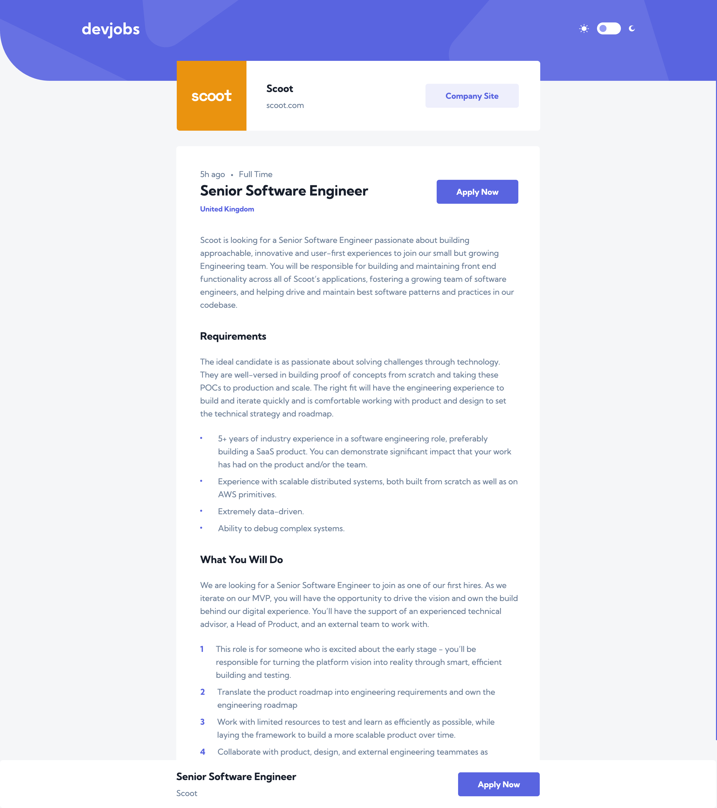
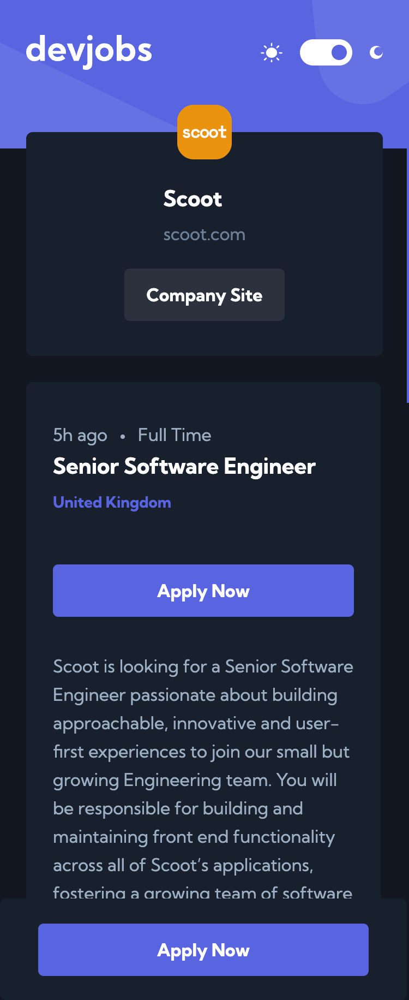

# Frontend Mentor - Devjobs web app solution

This is a solution to the [Devjobs web app challenge on Frontend Mentor](https://www.frontendmentor.io/challenges/devjobs-web-app-HuvC_LP4l). Frontend Mentor challenges help you improve your coding skills by building realistic projects.

## Table of contents

- [Overview](#overview)
  - [The challenge](#the-challenge)
  - [Screenshot](#screenshot)
  - [Links](#links)
- [My process](#my-process)
  - [Built with](#built-with)
  - [What I learned](#what-i-learned)
  - [Continued development](#continued-development)
  - [Useful resources](#useful-resources)
- [Author](#author)

## Overview

### The challenge

Users should be able to:

- View the optimal layout for each page depending on their device's screen size
- See hover states for all interactive elements throughout the site
- Be able to filter jobs on the index page by title, location, and whether a job is for a full-time position
- Be able to click a job from the index page so that they can read more information and apply for the job
- **Bonus**: Have the correct color scheme chosen for them based on their computer preferences. _Hint_: Research `prefers-color-scheme` in CSS.

### Screenshot








### Links

- Solution URL: [GitHub Repository](https://github.com/FerdinandoGeografo/devjobs-web-app)
- Live Site URL: [DevJobs](https://devjobs-web-app-fg.vercel.app/)

## My process

### Built with

- Semantic HTML5 markup
- CSS custom properties
- SASS / SCSS | BEM
- Native CSS Animations via `animate.enter`,
- Desktop-first workflow
- [TypeScript](https://www.typescriptlang.org/) - JS superset
- [Angular (v22)](https://angular.dev/) - Frontend Typescript Framework
- [Angular Material & CDK](https://material.angular.dev/) - UI Components libraries

### What I learned

I kept my usal feature-based folder structure for this challenge: each feature gets its own `data-access` (signal based store services), `ui` (dumb components) and, when it makes sense, `types` and utilities. It keeps every feature\routed component self-contained and easy to navigate without having to guess where a piece of logic lives.

Filters and pagination are driven entirely by the **URL**, which I treat as the single source of truth:
the option `withComponentInputBinding()` maps `query`, `logcation`, `fullTimeOnly` and `limit` straight from the route's query params onto `Jobs`' inputs, and two effects synchronize them with `JobsStore`:

```ts
readonly query = input<string>();
readonly location = input<string>();
readonly fullTimeOnly = input(false, { transform: booleanAttribute });
readonly limit = input(JOBS_PAGE_SIZE, { transform: transformLimit });

constructor() {
  effect(() => {
    this.jobsStore.setFilter({
      query: this.query() ?? '',
      location: this.location() ?? '',
      fullTimeOnly: this.fullTimeOnly(),
    });
  });

  effect(() => {
    this.jobsStore.setLimit(this.limit());
  });
}
```

`jobsStore.filter()` then flows down into `JobsFilters` as a `model()` input, which is exactly what gets handed to `form()` to build the **Signal Form** - so the form is always initialized from whatever the URL currently says.

Submitting the filters doesn't touch the store directly: it reads the form's model value and asks the router to navigate:

```ts
protected onSearch(filter: Filter) {
  this.router.navigate(['/jobs'], {
    queryParams: { ...filter, limit: this.jobsStore.limit() },
    queryParamsHandling: 'merge',
  });
}
```

The navigation itself is what triggers the search. No manual "refresh" call anywhere, and as a side benefit filters and pagination are shareable/bookmarkable and survive a page reload for free.

The main thing I wanted to practice was **Angular Signal Forms**, stable in `v22`. I used them to drive jobs filters, and the part I liked the most is how naturally the `FieldTree` ,that a `form()` returns, can be shared.
The desktop layout renders location and full-time as inline fields, while on mobile the same fields live inside a `MatDialog`. Instead of duplicating state or syncing a draft back and forth, I just pass the relevant `FieldTree` nodes through `MAT_DIALOG_DATA` - the dialog binds to the very same signals, so there is a single source of truth:

```ts
protected openMoreFilters() {
  const ref = this.dialog.open(JobsFiltersDialog, {
    data: this.filtersForm,
    width: '100%',
    maxWidth: '87.2vw',
  });
  this.dialogRef.set(ref);
  ref.afterClosed().subscribe((res: Filter | null) => {
    this.dialogRef.set(null);
    if (res !== null) this.searchClicked.emit(res);
  });
}
```

I paid attention to was **where global state should live**: things like the color theme or the current breakpoint are cross-cutting UI concerns, so they got their own stores under `shared/data-access`.

Last, I used this challenge to practice Angular's native CSS-driven enter animations; I put together:

- a single `_animations.scss` partial;
- shared timing/easing custom variables;
- a small set of `fade-in-*`/`bounce-in-*` keyframes;
- a `.animate--stagger` modifier driven by a `--index` custom property so items can animate one after another.

```scss
&--stagger {
  animation-delay: min(
    calc(var(--index, 0) * var(--animation-stagger, 35ms)),
    var(--animation-stagger-max, 350ms)
  );
}
```

```html
<li animate.enter="animate animate--stagger animate--bounce-in-top" [style.--index]="$index">
  <app-jobs-list-item [job]="job" />
</li>
```

`prefers-reduced-motion` is handled once, inside the shared `.animate` class itself, so every animation applied through `animate.enter` is automatically muted for users who asked for reduced motion.

### Continued development

The project is intentionally front-end only, but the most natural next step would be to put a real API behind it and move filtering, searching and pagination (the limit query param) server-side, instead of running them client-side over the full dataset every time. It would also be a good excuse to revisit JobsStore around httpResource's request-reactivity instead of the current signal-based filter/limit combo.

### Useful resources

- [Angular Signal Forms](https://angular.dev/guide/forms/signals/overview) - the official guide to Signal Forms; this is what the jobs filters are built on, shared as-is between the desktop layout and the mobile filters dialog.

- [Enter and Leave animations](https://angular.dev/guide/animations) - Angular's guide to animate.enter/animate.leave, the native CSS-based replacement for @angular/animations. Used for every entrance animation and stagger effect in the app.

## Author

- Frontend Mentor - [@FerdinandoGeografo](https://www.frontendmentor.io/profile/FerdinandoGeografo)
- LinkedIn - [@FerdinandoGeografo](https://www.linkedin.com/in/ferdinandogeografo/)
- GitHub - [@FerdinandoGeografo](https://github.com/FerdinandoGeografo/)
